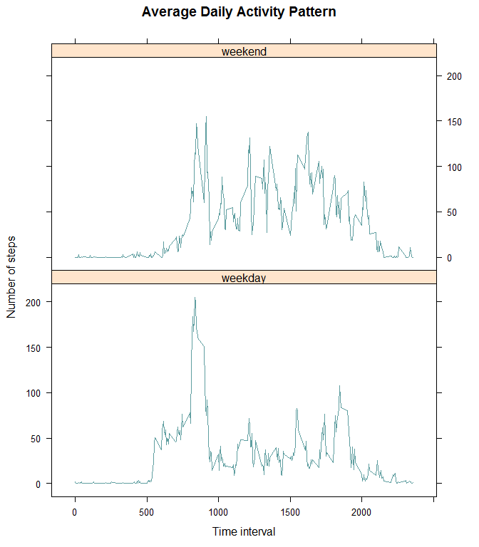

# Reproducible Research: Peer Assessment 1

**Analysis of activity monitoring data**

This document corresponds to Peer Assessment 1 (as of May 2015) of the Reproducible Research course by Roger D. Peng, PhD, Jeff Leek, PhD, Brian Caffo, PhD, from John Hopkins University, available online through Coursera.

The dataset is data from a personal activity monitoring device. This device collects data at 5 minute intervals through out the day. The data consists of two months of data from an anonymous individual collected during the months of October and November, 2012 and include the number of steps taken in 5 minute intervals each day.The time is expressed in military format, omitting any leading zero, e.g., 510 is 5:10 am.

The lattice package is used to generate plots on this document.

## Loading and preprocessing the data

Data is loaded from the csv file and the date column is converted to date objects.


```r
df<-read.csv(unz('activity.zip','activity.csv')) #Load data from zip
df$date<-as.Date(df$date) #Convert date from character to date type
```

This dataset includes 17568 observations of 3 variables.

Here is a view of the top rows of the dataset.


```r
head(df) #Have a look
```

```
##   steps       date interval
## 1    NA 2012-10-01        0
## 2    NA 2012-10-01        5
## 3    NA 2012-10-01       10
## 4    NA 2012-10-01       15
## 5    NA 2012-10-01       20
## 6    NA 2012-10-01       25
```

## What is mean total number of steps taken per day?

The sum of steps per day is calculated and the distribution is plotted as an histogram. 


```r
library(lattice) #Lattice package as dependency

agg<-aggregate(steps~date,data=df,FUN=sum,na.rm=TRUE) #Sum of steps by date/day
histogram(~steps,data=agg,
      breaks=20, type='count', col='cadetblue',
      main='Distribution of Total Steps Per Day',xlab='Number of steps') #Plot it
```

 

```r
mean_steps<-mean(agg$steps) #Compute mean number of steps
med_steps<-median(agg$steps) #Compute median number of steps
```

The mean number of steps taken per day is 10766.19 and the median is 10765.

## What is the average daily activity pattern?

The mean number of steps per time interval is calculated and the evolution thoughout the day is plotted as a line graph. 


```r
agg1<-aggregate(steps~interval,data=df,FUN=mean,na.rm=TRUE) #Mean of steps per interval
xyplot(steps~interval,data=agg1,
        type='l', col='cadetblue',
        main='Average Daily Activity Pattern',xlab='Time interval',ylab='Number of steps') #Plot it
```

 

```r
max_steps<-max(agg1$steps) #Compute max number of steps in dataset
max_time<-agg1$interval[match(max_steps,agg1$steps)] #Get index of max_steps and get corrresponding interval
```

The 5-minute time interval containing the maximal average number of steps is 835, with an average of 206.17 steps.

## Imputing missing values

The number of missing values is computed.


```r
n_missing<-sum(is.na(df$steps)) #Get count of missing steps values
```

There are 2304 missing values in the dataset.

By design choice for this analysis, missing data will be substituted for the median  number of steps for the corresponding time interval. Median may be more represesentative of the data on such skewed zero-bound distributions.


```r
agg2<-aggregate(steps~interval,data=df,FUN=median,na.rm=TRUE) #Median of steps per interval as imputed data
df_nona<-df #Copy of original data
added<-c() #Vector of values that were added
for(i in 1:nrow(df_nona)){ #Replace NAs with imputed value for same interval
    if (is.na(df_nona$steps[i])){
        substitute<-agg2$steps[match(df_nona$interval[i], agg2$interval)]
        df_nona$steps[i]<-substitute
        added<-append(added, substitute)
    }
}
```

Here is a view of the top rows of the dataset after imputation.  


```r
head(df_nona) #Just a display to check that NAs are gone
```

```
##   steps       date interval
## 1     0 2012-10-01        0
## 2     0 2012-10-01        5
## 3     0 2012-10-01       10
## 4     0 2012-10-01       15
## 5     0 2012-10-01       20
## 6     0 2012-10-01       25
```

And here is a view of the most common values that were inserted.


```r
added<-data.frame(table(added))
added<-added[order(added$Freq, decreasing=TRUE), ]
head(added, 20)
```

```
##    added Freq
## 1      0 1880
## 3      7   56
## 4      8   32
## 22    33   32
## 8     13   24
## 10    15   24
## 13    19   24
## 17    26   24
## 6     10   16
## 11    16   16
## 16    25   16
## 19    30   16
## 2      6    8
## 5      9    8
## 7     12    8
## 9     14    8
## 12    18    8
## 14    20    8
## 15    24    8
## 18    28    8
```

A total of 2304 NA values have been imputed, of which 81.6% were imputed as zero.  

The sum of steps per day is then calculated again and the distribution is plotted as an histogram.


```r
agg3<-aggregate(steps~date,data=df_nona,FUN=sum,na.rm=TRUE)
histogram(~steps,data=agg3,
          breaks=20, type='count', col='cadetblue',
          main='Distribution of Total Steps Per Day \nAfter Imputation of Missing Values',xlab='Number of steps')
```

 

```r
mean_steps_nona<-mean(agg3$steps) #Compute mean number of steps after imputation
med_steps_nona<-median(agg3$steps) #Compute median number of steps after imputation
```

After imputation of missing values, the mean number of steps taken per day is 9503.87 and the median is 10395.

This method of imputation of missing values lowered the mean and the median number of steps per day, with greater effect of the mean. This is expected as we saw that most of the imputed values were actually zeros.

## Are there differences in activity patterns between weekdays and weekends?

The date column is processed to determine if the day is a week day or a week-end day. Then the mean number of steps per time interval is calculated separately for week days and week-end days. The evolution throughout the day is plotted as a line graph. 


```r
for (i in 1:nrow(df_nona)){ #Determine if day is weekend day or not based on date
    day<-weekdays(df_nona$date[i])
    if(day %in% c('Saturday','Sunday')){
        df_nona$day[i]<-'weekend' #Set as 'weekend' if it is Saturday or Sunday
    }
    else{
        df_nona$day[i]<-'weekday' #Else set as 'weekday'
    }
}

df_nona$day=as.factor(df_nona$day) #Convert new variable to factors

agg4<-aggregate(steps~interval+day,data=df_nona,FUN=mean,na.rm=TRUE) #Mean of steps per interval
xyplot(steps~interval|day,data=agg4,
        type='l', layout=c(1,2), col='cadetblue',
        main='Average Daily Activity Pattern',xlab='Time interval',ylab='Number of steps') #Plot it
```

 

Average activity on week days starts earlier, at about 500, is mostly prominent around 800-900 and 1800-1900. Average activity on week-end days is more spread out during the waking hours of the day, while a peak of activity around 800-900 is still visible.
